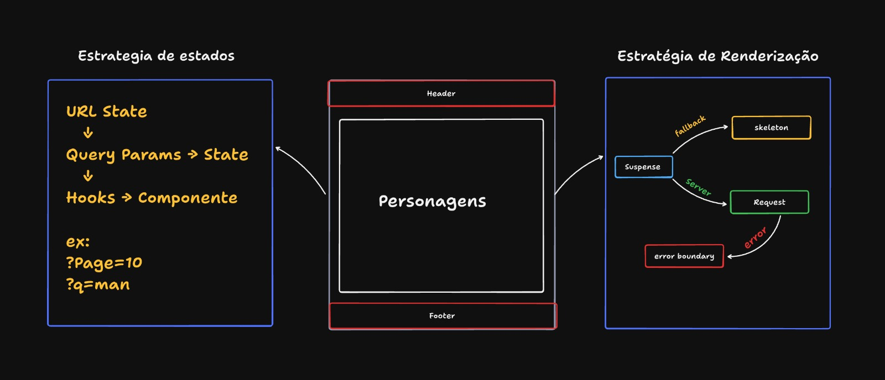
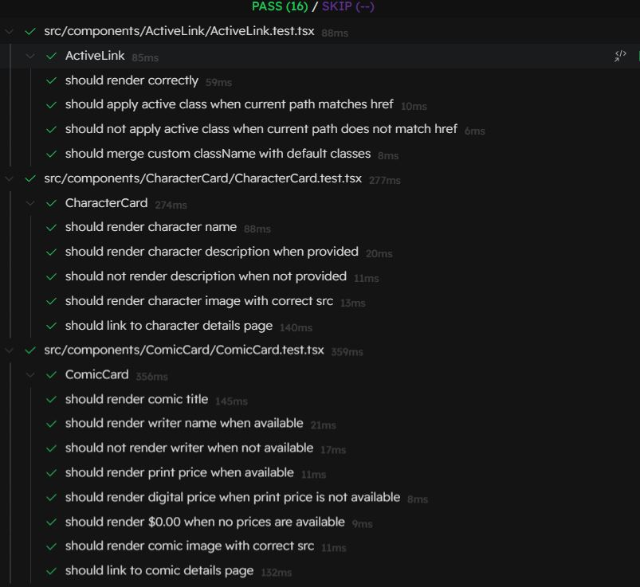
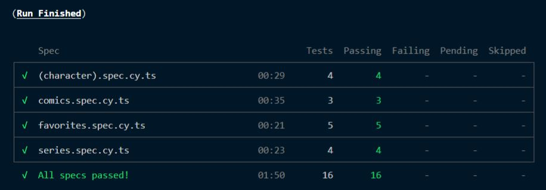

# Marvel Characters Explorer

Explore o projeto em produção: [PROJETO](https://frontend-marvel.vercel.app/)

## Preview do Projeto

### Desktop


### Mobile


## Soluções Implementadas


## Configuração do Ambiente Local

### 1. Criar conta Marvel Developer
- Acesse [Marvel Developer Portal](https://developer.marvel.com/)
- Crie sua conta
- Obtenha suas chaves de API (public key e private key)

### 2. Configurar Domínios
- No Marvel Developer Portal, vá em "My Developer Account"
- Em "Your Authorized Referrers", adicione:
  - `localhost`
  - `127.0.0.1`

### 3. Configurar Variáveis de Ambiente
Crie um arquivo `.env` na raiz do projeto:
```env
NEXT_PUBLIC_MARVEL_PUBLIC_KEY=sua_public_key_aqui
NEXT_PUBLIC_MARVEL_PRIVATE_KEY=sua_private_key_aqui
```

### 4. Instalar e Rodar
```bash
npm install
npm run dev
```

## Testes

### Testes Unitários (Vitest)


### Testes E2E (Cypress)

